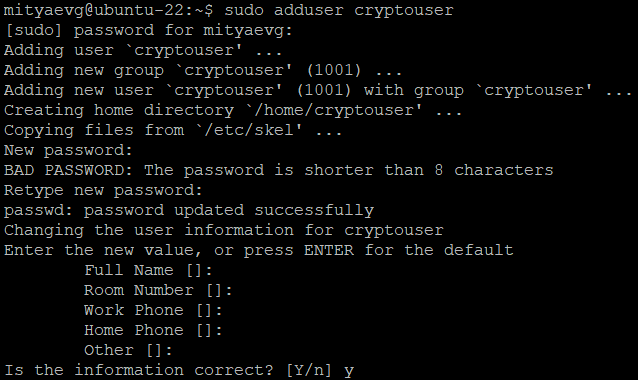
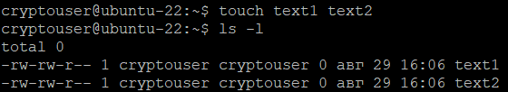
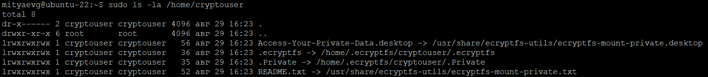
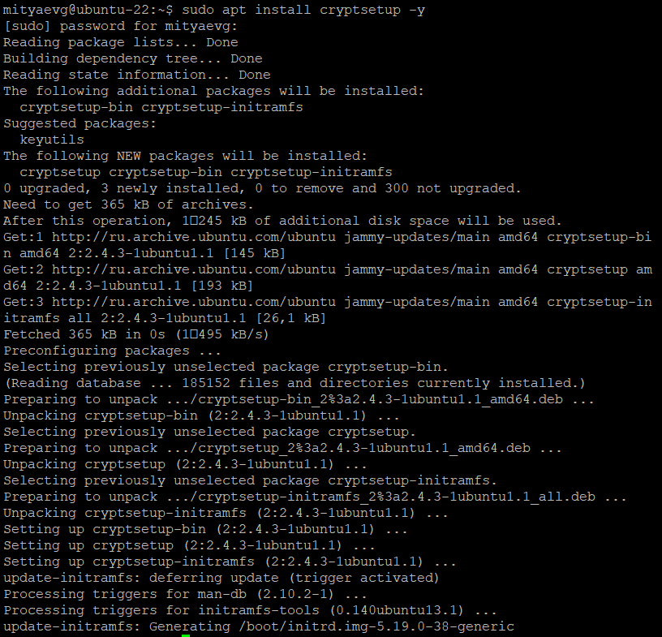
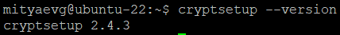
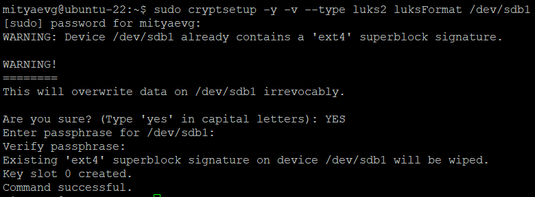
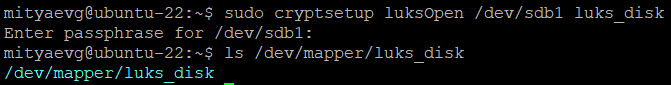
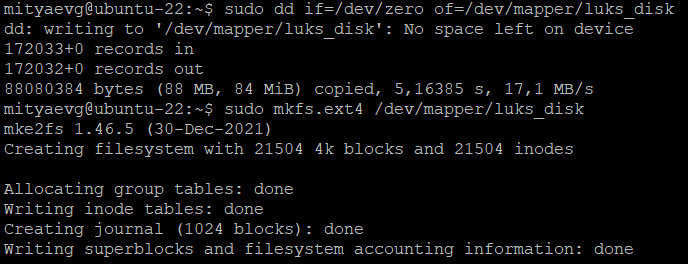
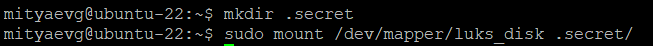

# 13-02_ecryptfs_luks
# Домашнее задание к занятию  «Защита хоста»

### Задание 1

1. Установите **eCryptfs**.
2. Добавьте пользователя cryptouser.
3. Зашифруйте домашний каталог пользователя с помощью eCryptfs.

*В качестве ответа  пришлите снимки экрана домашнего каталога пользователя с исходными и зашифрованными данными.*

**Ответ:**

1. Установим **ecryptfs** в ВМ под управлением **Ubuntu 22.04.2**:
```
apt install ecryptfs-utils cryptsetup -y
```
2. Добавим пользователя **cryptouser**:
```
sudo adduser cryptouser
su - cryptouser
```
<kbd></kbd>

3. Зашифруйте домашний каталог пользователя **/home/cryptouser** с помощью **eCryptfs**:
```
touch text1 text2
```
- Посмотрим содержимое еще не зашифрованной домашней директории пользователя:
  
<kbd></kbd>

- Зашифруем содержимое каталога:
```
sudo ecryptfs-migrate-home -u cryptouser
sudo ls -la /home/cryptouser
```
<kbd></kbd>

---

### Задание 2

1. Установите поддержку **LUKS**.
2. Создайте небольшой раздел, например, 100 Мб.
3. Зашифруйте созданный раздел с помощью LUKS.

*В качестве ответа пришлите снимки экрана с поэтапным выполнением задания.*

**Ответ:**

1. Установим поддержку **luks**:
```
sudo apt install cryptsetup -y
```
<kbd></kbd>
<kbd></kbd>

2. Создадим новый раздел размером 100 МБ с помощью утилиты **gparted**:
```
sudo apt install gparted -y
sudo gparted
```
<kbd></kbd>

3. Зашифруйте созданный раздел:

- Зададим тип файловой системы - **luks2** для раздела **/dev/sdb1**:
```
sudo cryptsetup -y -v --type luks2 luksFormat /dev/sdb1
```
<kbd></kbd>

- Смонтируем раздел:
```
sudo cryptsetup luksOpen /dev/sdb1 luks_disk
ls /dev/mapper/disk
```
<kbd></kbd>

- Отформатируем раздел:
```
sudo dd if=/dev/zero of=/dev/mapper/luks_disk
sudo mkfs.ext4 /dev/mapper/luks_disk
```
<kbd></kbd>

- Монтирование открытого раздела:
```
mkdir .secret
sudo mount /dev/mapper/luks_disk .secret/
```
<kbd></kbd>
